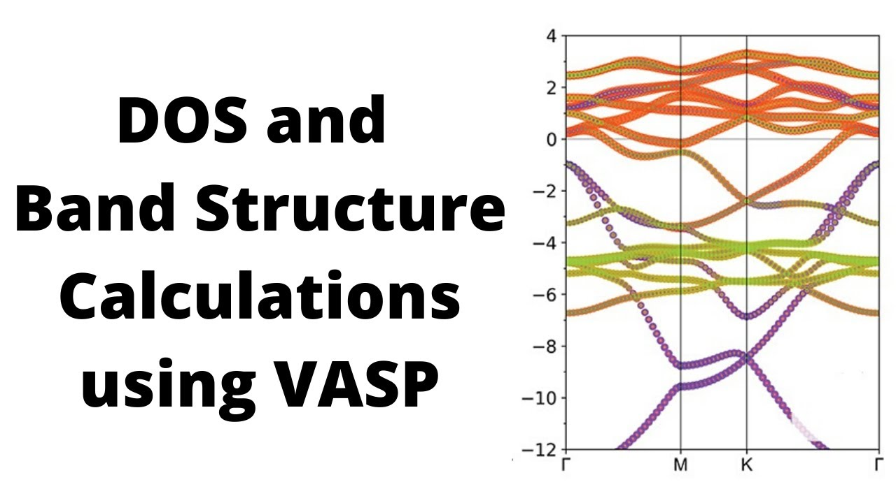

# Optical properties of the NV center from constrained-occupation DFT calculations.

Development of solid state quantum bit (qubit) in wide band gap semiconductors is one of the groundbreaking achievement of the last decade. The NV center is diamond is the most studied and most
widely used point defect based qubit of all. It is simply a single negatively charged nitrogen
substitutional-carbon vacancy point defect pair in the diamond lattice that possesses a S = 1 electron
spin in the ground and optical excited states. The spin of NV center can be manipulated by microwave
and optical irradiation, while the spin states of the defect can be read out by optical means. Optical
properties of the NV center are thus particularly important for qubit applications.
Create an NV center in the relaxed diamond lattice and compute its optical properties using
constrained occupation density functional theory method. Compare your results with the
experimental values and discuss the differences.

Schedule:
* Part 1 perfect diamond properties: lattice constant, bulk modulus, and band structure
* Part 2 configuration and ground state electronic structure of the NV-center in diamond
* Part 3 optical properties of the NV center in diamond: absorption, emission, and ZPL
energies and Stokes and anti-Stokes shifts

Literature:
<https://en.wikipedia.org/wiki/Nitrogen-vacancy_center>
<https://arxiv.org/pdf/1302.3288.pdf>

