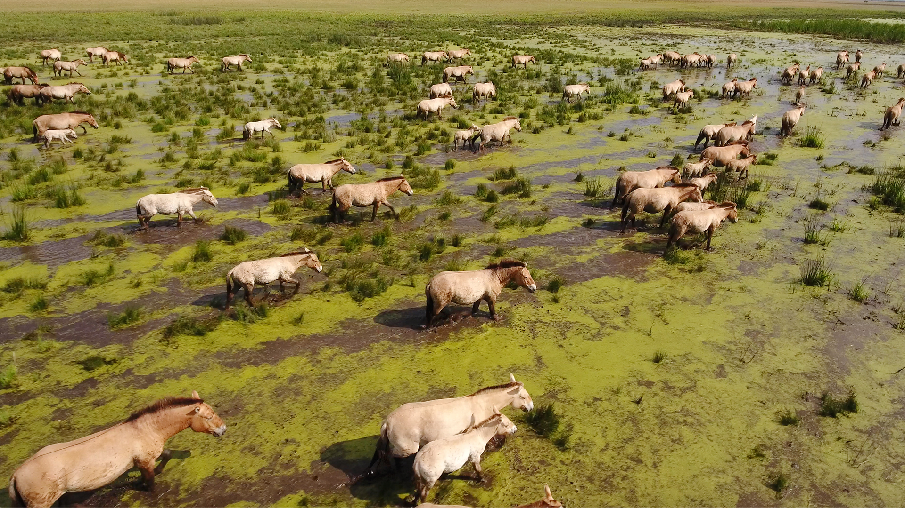
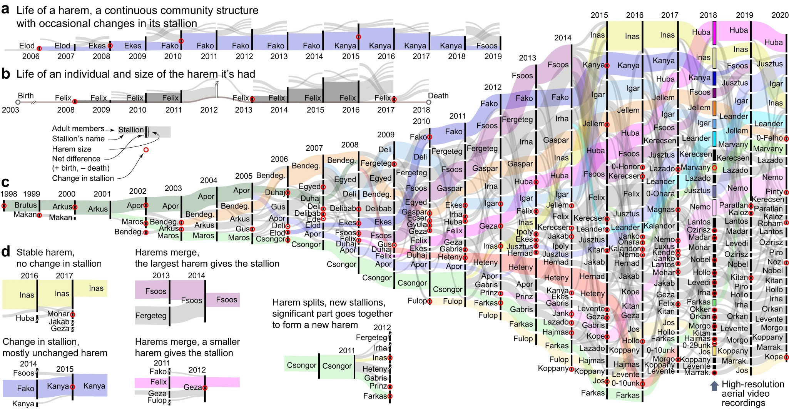

# Group dynamics in wild horse population - effect of male foals on harem stability

## Introduction

The wild horse herd living in isolation in Pentezug, Hortobágy, consists of 
approximately 300 individuals. This group breaks into smaller harems, which 
typically consist of several mares, their foals, and usually one harem stallion. 
Female offspring leave the natal harem at the age of 2–3 years and join other
harems; males leave at the age of 2–4 years (or even later) and join with other
non-breeding but already dispersed males and former harem stallions to form 
single-sex bachelor groups. The harems show an interesting dynamics as they 
change over the years: their size may increase or decrease, harem stallion
can be replaced after a successful bachelor attack. Furthermore, harems can 
merge or get completely dissolve into other harmes.

_Figure 1: Aerial image of the herd moving together. Individuals in closer
proximity are likely to be members of the same harem, while foals can be seen
even closer to their mothers [[3](#Literature)]._

_Figure 2: **a, b** Sample timeline from the point of view of a harem (a) and
of an individual harem stallion (b). For each year, the length of the vertical
heavy black line indicates the total number of members, with in-coming
(and out-going) edges pointing from (and towards) other harems. All adult members
are presented except bachelors. Names indicate the harem stallion, red circles
indicate stallion changes. **c** Data visualisation from the long-term population
monitoring from 1998 to 2020. The longest lasting harems are indicated by coloured
lines. **d** Examples of important events related to changes in harem structure or to
emergence of a new harem stallion [[1](#Literature)]._

## Project

The goal of the project is to examine how male foals that stay in their natal
harem for a shorter or longer period influence the stability of the given harem.
For that data exploration is needed and necessary quantities should be defined
and calculated. Once the real-data based results are available, an additional 
model may be proposed and supported by simulation results.

## Summary of the datasets

The dataset available for the project includes records from over 80 field 
observations conducted over 20 years. For each of the 80 observation dates, 
the observed harem ID-s, the members of those harems, and the names of the 
harem stallions are provided. Additionally, kinship data are also available.

## Steps

1. Understand and visualize the dataset
2. Define necessary quantities and extract them from the data
3. Analyse results and discuss findings

## Literature

1. Ozogány, K., Kerekes, V., Fülöp, A., Barta, Z., & Nagy, M. (2023). Fine-scale 
collective movements reveal present, past and future dynamics of a multilevel 
society in Przewalski’s horses. *Nature Communications, 14*(1), Article 5096.
https://doi.org/10.1038/s41467-023-40523-3
2. Kerekes, V., Sándor, I., Nagy, D., Ozogány, K., Göczi, L., Ibler, B., Széles, L.,
& Barta, Z. (2021). Trends in demography, genetics, and social structure of 
Przewalski’s horses in the Hortobágy National Park, Hungary over the last 22 years. 
Global Ecology and Conservation, 25, e01407. https://doi.org/10.1016/j.gecco.2020.e01407
3. National Geographic Hungary. (2020, June 9). A vadlovak birodalma: Pentezug. 
Retrieved from https://ng.24.hu/termeszet/2020/06/09/a-vadlovak-birodalma-pentezug/
