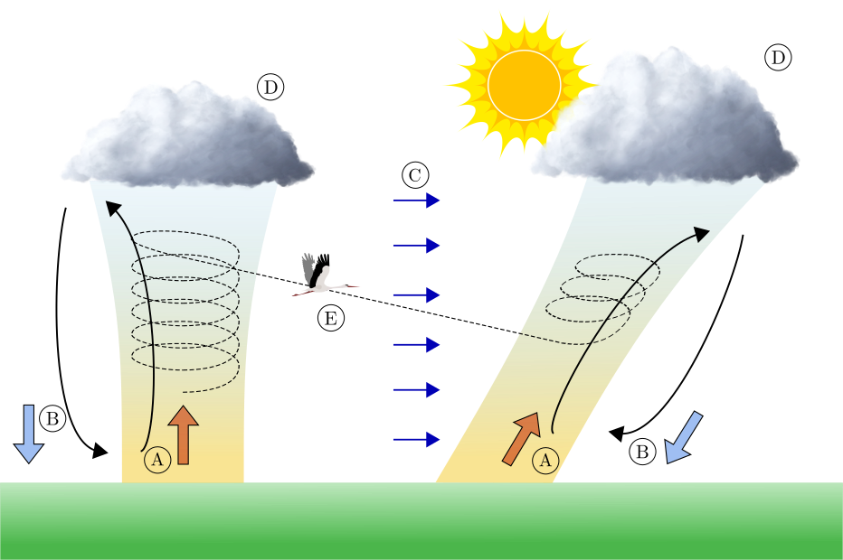

# Collective motion

Study collective motion

## Introduction
In this project you will experiment with a simulation framework with the goal of generating flocks of soaring birds (such as storks or vultures) while flying in a atmospheric convective updraft (thermal).

There are two major goals on this project. The first is to explore the possible outputs this framework offers and display them in a precise and scientifically meaningful way. The second goal is to characterize the individual trajectories and airflows, and how they connect to each other.

Important note: It would be prefered if you used Linux. Although the software should run in any platform, it was developed in Linux so there may be some hidden incompatibility with other OS. Furthermore, the installation process is much, much easier on Linux.

## Steps
1. Install the simulation program and dependencies. Run the default config file. * Download the repository from asasdasd: git clone 
* Download the repository from asasdasd: git clone
* Or Download the zip file from asasdasd: 
* Install python 3.9
* Create and activate your virtual environment: https://packaging.python.org/en/latest/guides/installing-using-pip-and-virtual-environments/
* Install dependencies: https://packaging.python.org/en/latest/guides/installing-using-pip-and-virtual-environments/#using-requirements-files
* Copy config/default/bird_generate.default.yaml to config/bird_generate.yaml
* Run the simulation: python generate_flock.py config/bird_generate.yaml
2. Familiarize yourself with the basic parameters. Generate a number of flock using different parameters. Visualize your results
3. Find differences and similarities from the generated trajectories
4. Calculate metrics of thermalling success
5. Explore the parameter space for a certain air velocity field
6. Do the same for different air flows. How do they perform?
7. Are some strategies better suit for certain air flows?
 
## Recommended Literature
1. Ákos, Z., Nagy, M., & Vicsek, T. (2008). Comparing bird and human soaring strategies. Proceedings of the National Academy of Sciences, 105(11), 4139-4143.
2. Ákos, Z., Nagy, M., Leven, S., & Vicsek, T. (2010). Thermal soaring flight of birds and unmanned aerial vehicles. Bioinspiration & biomimetics, 5(4), 045003.
3. Flack, A., Nagy, M., Fiedler, W., Couzin, I. D., & Wikelski, M. (2018). From local collective behavior to global migratory patterns in white storks. Science, 360(6391), 911-914.
4. Nagy, M., Couzin, I. D., Fiedler, W., Wikelski, M., & Flack, A. (2018). Synchronization, coordination and collective sensing during thermalling flight of freely migrating white storks. Philosophical Transactions of the Royal Society B: Biological Sciences, 373(1746), 20170011.
5. Nagy, M., Ákos, Z., Biro, D., & Vicsek, T. (2010). Hierarchical group dynamics in pigeon flocks. Nature, 464(7290), 890-893.

