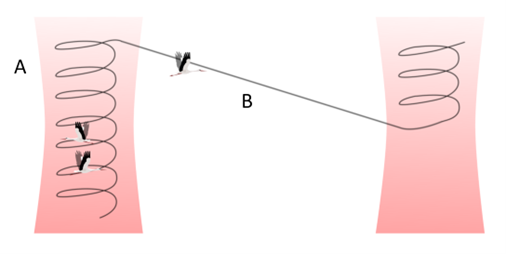
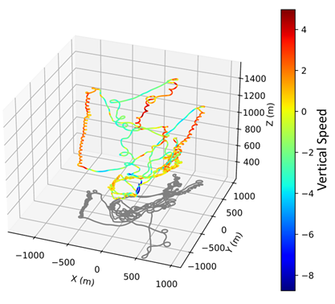

# Analysing biologging data for understanding flight performance and behaviour 

## Introduction
 

*Figure 1: Soaring birds rely on atmospheric updrafts, primarily known as thermals, to gain altitude (A). Subsequently, they utilize this gained height to cover distances without flapping their wings, a technique referred to as gliding (B), until they encounter the next thermal.* 

 

*Figure 2: A complete flight track of an individual Himalayan vulture from our dataset includes data from take-off to landing. The colour code indicates the bird's instantaneous vertical speed, with shades of yellow and red representing ascending flight and green and blue denoting descending flight.*

This project involves experimenting with high-resolution GPS data of soaring birds, including falcons, eagles, and vultures, to analyse flight performance and behavioural differences among species. The primary objective is to explore the fixed-wing (non-flapping) flight performance of various bird species, with a focus on quantifying the gliding and thermalling components using GPS data. Another key goal is to investigate the influence of morphometry on the aerodynamics of bird flight. Additionally, you will be tasked with evaluating flight preferences, such as optimizing airspeed based on daily thermal strength. To complete this project, you will be expected to use Python and Flight 1.25 (Pennycuick, 2008) and follow the given literature. 

## Summary of the dataset 
The comprehensive dataset consists of raw GPS data (Latitude, Longitude, and Altitude), smoothed flight trajectories, calculated velocities, as well as detected thermals, and detected gliding segments. Moreover, the daily average wind velocity was calculated from the drift of the thermals and used for airspeed estimation for the gliding phase of flight.  

## Steps
1.	Understand and visualize the dataset.
2.	Create glide polar from the data. 
3.	Explore the thermal strength depending on the period of the day and the altitude. 
4.	Check the variation in the radius of thermals and compare this with the thermal strength and the period of the day.
5.	Find the bird’s bank angle in the thermal from the aerodynamic assumptions and investigate the change in bank angle depends on the thermal strength. 

## Literature
1.	Ákos, Z., Nagy, M., & Vicsek, T. (2008). Comparing bird and human soaring strategies. Proceedings of the National Academy of Sciences, 105(11), 4139-4143.
2.	Ákos, Z., Nagy, M., Leven, S., & Vicsek, T. (2010). Thermal soaring flight of birds and unmanned aerial vehicles. Bioinspiration & biomimetics, 5(4), 045003.
3.	Pennycuick, C. J. (2008). Modelling the flying bird. Elsevier.
4.	Anderson, J. D. (1999). Aircraft performance and design.
