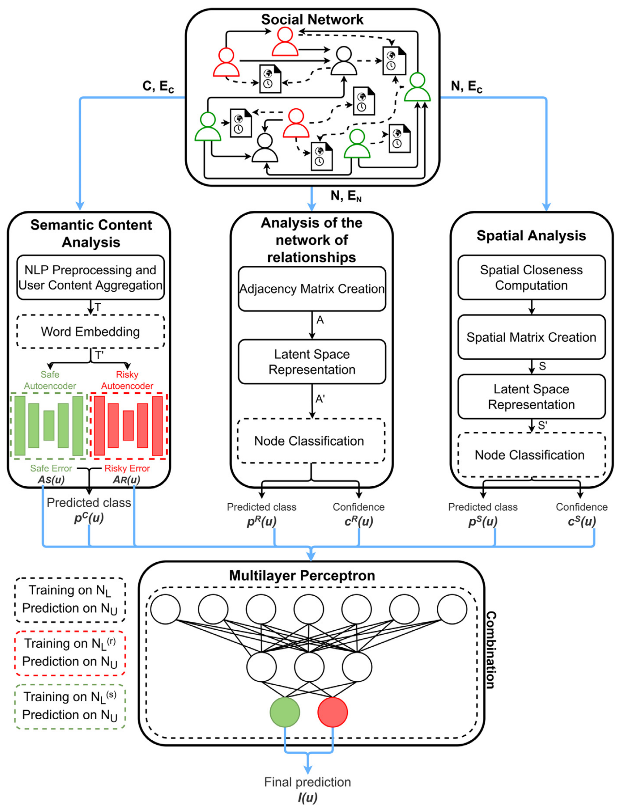

# key figures in social networks

### SAIRUS: Spatially-aware identification of risky users in social networks

Key-player identification is an important task for Social Network Analysis (SNA). In short, the goal is to identify nodes that represent users who exert an outsized influence over other users. When these key-players can be approximated with good tolerance their influence can be deamplified (or amplified depending on the goal). This way public discourse can be steered in the right direction. In large modern social networks this is a problem of crucial importance.

This project covers the reproduction of the SAIRUS model described in a [paper](https://www.sciencedirect.com/science/article/abs/pii/S1566253522002457). The method described in the paper focuses on the identification of risky users in terms of potential for hatred and terrorism, nevertheless any similar characterisation of nodes can be adopted if it fits the task of key-player identification.

SAIRUS solves the task by combining the information extracted from three different features:
* <ins>semantical information</ins>: the content of messages produced by the user are cleaned and concatenated into a single document; next, a word embedding method is applied to the aggregated message, assigning to each user a single, high-dimensional vector, finally autoencoders are used to produce a prediction
* <ins>relationship from network topology</ins>: the adjacency matrix of the follower relationships is created and processed with one of many possible dimension-reduction methods
* <ins>geographical closeness</ins>: after approximating the geographical location of the users a geographical closeness measure is calculated for each user pair, the resulting adjacency matrix is processed with dimension-reduction methods

Each perspective gives a prediction for the node classification task with some confidence and finally these are aggregated into a single output: risky or safe. Below is an overview of the model.

The task becomes even more interesting with the introduction of "borderline" users whose classification is ambiguous. For example in a real-world scenario journalists would be considered borderline. Such users often engage with risky content, even though, they themselves are not to be considered as risky.

During this project you will be expected to reproduce and study the results of the original paper. You can work with the self-collected data or with the original data of the paper.

Keywords:
* social networks
* node classification
* geometrical embedding
* natural language processing
* dimension reduction
* machine learning

