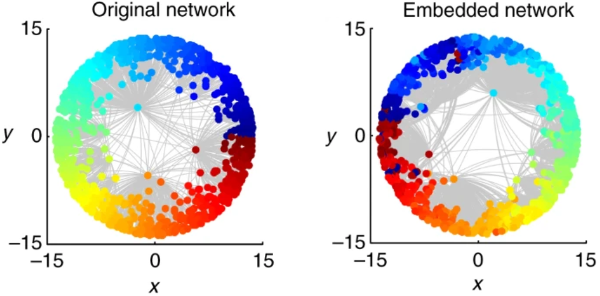

# Path lengths and distances in hypergraphs

Hypergraphs, in which nodes are connected by *hyper*edges that can express not only pairwise but higher-order interactions too, are gaining more and more attention in recent years with the increasing amount of accessible network data of this type. Just like in the case of usual graphs, it is an important task to develop so-called *embedding* algorithms that can arrange the nodes of a hypergraph in a geometric space, assigning a position vector to each node in such a way that e.g. smaller geometric distances between the nodes reflect stronger connections, or smaller topological distances (i.e., shorter paths) between them. Though there are several different [simple graph representations of hypergraphs](https://www.sciencedirect.com/science/article/pii/S0370157320302489#sec2.1.2) that can be inputted to embedding methods designed not specifically for hypergraphs, there is a rising need to develop such algorithms that works directly with hypergraphs, considering their hyperedges in their original form.

In the field of usual, dyadic graphs, the topic of geometric graphs is already thriving. Networks generated on the hyperbolic (i.e., negatively curved) plane using distance-dependent connection probabilities between the nodes are known to successfully reproduce many graph properties that are often observed in real-world networks. Meanwhile, several embedding algorithms have been proposed in the recent years, using both Euclidean and hyperbolic geometry. A relatively simple approach is to obtain a low-dimensional ($d\ll N$, where $N$ is the number of nodes) vector representation of each network node through dimension reduction, e.g. applying singular value decomposition on an $N\times N$-sized matrix of path lengths measured on the graph. 

*[The layout](https://www.nature.com/articles/s41467-017-01825-5#Fig1) of a simple graph generated on the hyperbolic plane (left) and a path length-based hyperbolic embedding of the same graph (right).*

The purpose of this project is to examine the possibilities for measuring topological distances in hypergraphs (i.e., for defining paths along *hyper*edges instead of pairwise links), and study how shortest path lengths are related to geometric node-node distances in hypergraphs generated on the hyperbolic plane.

## Proposed steps for the project

1. Generate graphs on the hyperbolic plane.
    1. Implement the standard $\mathbb{S}^1/\mathbb{H}^2$ [model of network generation](https://www.nature.com/articles/s41598-021-93921-2#Sec2) at $1/\alpha=0$ (i.e., when the connection probability function is a simple step function) in **Python**. Generate a network in the native representation of the hyperbolic plane e.g. with $N=10000$ nodes, having an expected average degree of $\langle k\rangle=10$ and a degree decay exponent of $\gamma=3$. Store the resulting graph as a **NetworkX Graph** object (see e.g. [this tutorial](https://networkx.org/documentation/stable/tutorial.html) – you don’t have to know anything about directed graphs, multigraphs, etc.).
    2. Check the resulted average degree and degree distribution. Plot the generated graph in the native representation of the hyperbolic plane.
    3. Calculate Spearman’s correlation coefficient between the graph's shortest path lengths (obtained from **NetworkX**) and the geometric node-node distances based on which the connections were generated. Are the topological distances strongly related to the geometric distances?
2. Modify the $\mathbb{S}^1/\mathbb{H}^2$ model to generate hypergraphs on the hyperbolic plane.
   1. Familiarize yourself with the **hypergraphx** package ([GitHub](https://github.com/HGX-Team/hypergraphx), [paper](https://arxiv.org/abs/2303.15356)): How are the hyperedges stored?
   2. Implement a hyperbolic model of hypergraphs, which arranges the network nodes on the hyperbolic plane the same way as the $\mathbb{S}^1/\mathbb{H}^2$ model but then, instead of connecting the closest node pairs, creates hyperedges as circles dropped onto the hyperbolic plane (nodes falling within a given circle will be connected by a hyperedge). Store the generated networks as **Hypergraph** objects from **hypergraphx**.
   3. Using the functions implemented in **hypergraphx**, check the obtained hyperedge size distribution, the hyperdegree distribution (where the hyperdegree of a node is the number of hyperedges to which the given node belongs) and the degree distribution (where the degree of a node is the number of nodes with which the given node has any connection).
   4. Using **hypergraphx**, transform the generated hypergraph to a simple graph with clique expansion, converting each hyperedge of cardinality (i.e., size) *k* to a *k*-clique, i.e. a fully connected subgraph of *k* nodes. 
4. Examine the matrix of shortest path lengths for hypergraphs that you generated and for their clique-projection.
   1. Try to create your own definition(s) for a shortest path in a hypergraph and/or acquire already existing definitions from the literature.
   2. Calculate Spearman’s correlation coefficient between the shortest path lengths of the hypergraph and the shortest path lengths measured along its dyadic projection. Does the pairwise projection seem to be an adequate substitute for the hypergraph, is it able to grasp the main features of the hypergraph's path length distribution?
   3. Calculate Spearman’s correlation coefficient between the obtained shortest path lengths and the geometric node-node distances based on which the hyperedges were generated. Which path length definition fits the geometric distances the best?

