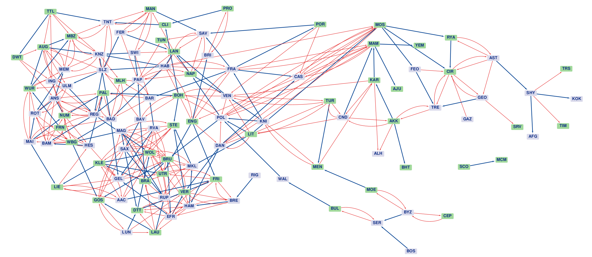

# Community detection in regular an signed networks

Due to the general concept of what a network is they have become one of the most common tools while studying complex systems, and are used in a number of fields of statistical physics and data science. In many  cases, nodes of the network can be grouped into different communities in such way that nodes from the same communities have similar topological features suggesting that these partition exists in the real system too. Hence, finding communities in efficient ways is an important problem in network science.

In the last few decades several community detection method has been published with a different ideas and implementations, but their effectiveness highly depends on the circumstances of the original problem.     However, the notion of modularity is a widely used measure to quantify how good is a given partition of a network, because it captures the basic features of what is thought to be a community.

This project provides an opportunity to become familiar with community detection using modularity optimisation, and to apply the usual methods in the less mainstream problem of signed networks. The suggested    steps of the project are the following, but students deviation from them is allowed, if their creativity or prior knowledge leads to elsewhere.

1. Familiarise with python's [networkx](https://networkx.github.io/) module that can help to handle networks (Any other network manipulation software is acceptable.). Do some basic operations (e.g. add edges,   remove nodes, calculate some scores etc.) on some small networks and use a convenient graphical software (e.g. [cytoscape](http://www.cytoscape.org), [plotly](https://plotly.com/), etc.) to visualize them.

2. Understand the notion of modularity and find some community detecting methods using it. Try to implement them (or find implemented versions), and experiment with using them on some real networks. Collect     your experiences: What are the pros and the cons of different methods?\
Some potentially usefull paper to begin with:
    * [The first paper about modularity](https://arxiv.org/pdf/cond-mat/0308217.pdf)
    * [Some info about modularity optimization](https://ieeexplore.ieee.org/stamp/stamp.jsp?arnumber=4358966&casa_token=ZxWx_aeng2oAAAAA:akUu0zzTw4JfudtAxmZvuTsuQvk2BcTos0vIHhCa4MSHaKHA2rs0UECD1aib0bXrphTWML2-9eGOzg&tag=1)
    * [The louvain algorithm](https://arxiv.org/pdf/0803.0476.pdf)

3. Though using modularity for finding communities in undirected, unweighted networks is very popular, its generalisation to different directions is not trivial. Based on the knowledge and interpretation you    gained in the previous tasks, try to modify (or find some modification) of the previously tried methods in such way that they can find communities in signed networks i.e. in the case where there are also        "negative edges" in the network.\
More precisely: In a regular network connection between two nodes expresses the desire of being in the same community. But what if there are another type of connection that expresses the desire of being in      separate communities? How can modularity be used in such a network?

Some benchmark networks to experiment with:
* [Karate club](https://networkx.org/documentation/stable/auto_examples/graph/plot_karate_club.html)
* [Football](https://networkx.org/documentation/stable/auto_examples/graph/plot_football.html)
* [Rosenfeld crime](http://konect.cc/networks/moreno_crime/)
* [movies, Netflix](http://academictorrents.com/details/9b13183dc4d60676b773c9e2cd6de5e5542cee9a)

Signed networks to experiment with are the diplomatic realtion data extracted from EU4. (Bogdán can share these files)

Other real-life networks can be found on these portals:
* [KONECT Project](http://konect.cc/networks/)
* [The Colorado Index of Complex Networks (ICON)](https://icon.colorado.edu/#!/networks)
