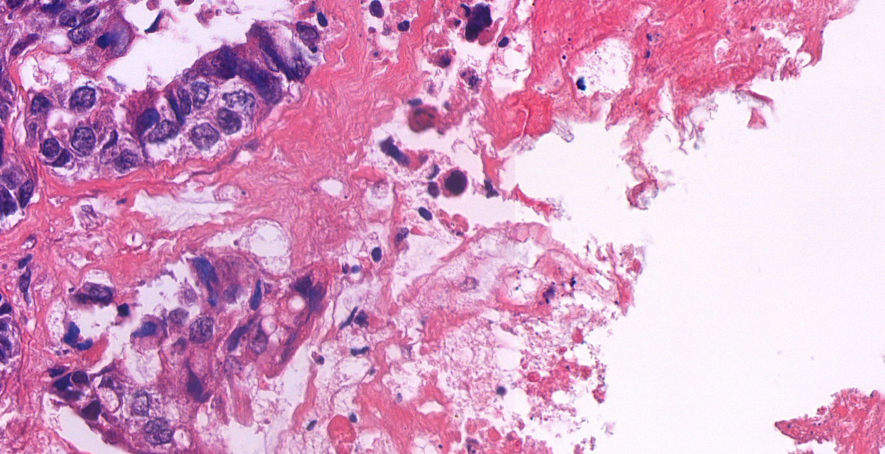

# Cancer classification with sample selection performed on mid-infrared spectra collected from tissue samples with colorectal cancer

## 1. Short description

Colorectal cancer stands among the most prevalent cancer types in Hungary, and is a hot topic in medical analysis. Mid-infrared (MIR) spectroscopy provides biochemical information on the underlying tissue by displaying the intensity of molecular vibrations.
Our previous studies have already indicated that MIR spectroscopy could be used as an effective embedding tool that retains the ability to separate cancerous and non-cancerous tissue. One approach to proceed, is to give every tissue sample a label that denotes whether the sample contained cancerous or non-cancerous tissue.
This of course would mean that every single spectrum collected from a specific tissue sample is granted the same label. However, without complete knowledge of tissue sample inner structure, such as tumour boundaries, a global sample label would encompass spectra not possessing information relevant to the classification task.

While collecting spectra, a small area of a tissue sample is scanned by a microscope. The procedure results in a one-dimensional array with hundreds of data points. A data point signifies the percentage of IR transmittance through the sample at a specific wavelength.
The spatial position of the spectrum on the tissue sample is also retained, therefore the neighbouring spectra can be displayed together as a heatmap of the underlying tissue sample. 
In conclusion, MIR spectra are embeddings of an image containing biochemical information, where the image is a physical patch of the tissue sample and the embedding generator model is the microscope.
Machine learning models such as XGBoost can conveniently handle embeddigs as simple tabular data to perform classification. Using the previously described global labels, our results are far from perfect, therefore we need to examine the spectra locally.

The goal of this project is to deduce which spectra affects classification negatively and why? Could we reconstruct the inner structure of the tissue samples without pathologist approved annotations? What are these "negative" spectra?
Could it be that surrounding tumour boundaries within a tissue sample sits perfectly normal and non-cancerous tissue that was mislabelled as cancerous because of the global labels?

## 2. Requirements:

- Python coding: pandas, matplotlib, sklearn, ...
- Having attended the Data mining and machine learning course (strongly recommended)
- Weekly mandatory consultations (can be online, but fixed timing)

## 3. Project outline

1. Data access and handling:
   - Download the dataset from  https://doi.org/10.5281/zenodo.17790337. Beside the MIR data it contains Whole Slide Images that can be used to display data in presentations.
   - Familiarize yourself with the dataset. Example notebooks are here: https://github.com/borbende/Colorectal_cancer_dataset_MIR_spectroscopy_and_WSIs.
   - To understand the data you are using, study these two short articles: https://doi.org/10.1002/cem.3542, https://doi.org/10.1007/s00292-025-01502-1.
   - Create summary figures to showcase MIR data: some random spectra, spectral heatmap, background spectra,...
2. Data cleaning and building an ML dataset
   - Convert spectra from transmittance to absorbance. (Beer-lambert law)
   - Normalize. (Standard normal variate)
   - Get the sample IDs, cancer labels and patient IDs from the metadata .csv files. Combine them with your spectra upon loading!
   - Study and use the background spectrum removal process displayed in one of the example notebooks. Remove all background spectra! Does this removal produce the same result every time?
3. Machine learning basics
   - The task is binary classification (NC vs CRC). Filter the dataset down to the relevant classes. Display class distributions: number of spectra, number of tissue samples, number of patients, number of overlapping patients.
   - Create 5 train-test splits for 5-fold cross-validation. A patient cannot have data in both the train and the test set! Likewise, a sample must have data only in one of the two sets! Also, classes should be at least somewhat balanced. Hint: StratifiedGroupKFold().
   - Define an XGBoostClassifier for binary classification. Simply test if it runs on a fold. Why did we choose XGBoost? Are there memory issues during data loading?
4. Optimization
   - The entire dataset is about 10 GBs, which can cause memory problems during data loading. Discover methods in the XGBoost package to mitigate this issue: DMatrix, streaming for training, or alternate pandas-like packages e. g. polars.
   - Try handling data directly from hard drive. (libsvm)
5. Perform the 5-fold cross-validation with the XGBoost model:
   - Run the model for all folds separately.
   - Display the confusion matrices for the test sets and the AUROC curves.
   - The efficiency metrics are: overall accuracy, AUROC score, sensitivity, specificity. What are these? What are their ranges? How do you define the latter two in our case?
   - Display a summary table of the metrics in an aggregated form: mean values and confidence intervals. Be prepared to explain your results!
   - Congratulations! You have reproduced the results using the global labels!
   - Bonus: use SHAP to check which features (wavenumbers) were the most important.
6. Sample selection:
   - Just in case, remove the CO2 peak from all spectra and check the difference in the results. You may need to use interpolation.
   - Run the models again and highlight the spectra in the test sets that were misclassified.
   - Does removing all these spectra from training and testing perfects the model?
   - Collect these spectra and display them. Where are their position on the heatmaps compared to correctly classified ones?
   - Compare them with each other and with correctly classified spectra using metrics such as correlation and other vector similarity metrics.
   - Compare them within certain spectral regions. Could a certain region contain all variability or is it spread out?
7. Final tasks:
   - Create a GitHub repository to store your project in. All code should have proper documentation: comments, markdown cells,... Create a well-organized README.md file.
   - Draw your conclusions! Could you recreate the inner structure of the tissue samples?
   - Have a slide on multiple instance learning (MIL). Would that help with our problem?

## 4. Pointers, useful links
- MIR dataset:  https://doi.org/10.5281/zenodo.17790337
- MIR GitHUb repository: https://github.com/borbende/Colorectal_cancer_dataset_MIR_spectroscopy_and_WSIs
- openslide-python documentation: https://openslide.org/api/python/
- A useful tutorial for openslide-python: https://www.youtube.com/watch?v=QntLBvUZR5c
- MIR articles: https://doi.org/10.1002/cem.3542, https://doi.org/10.1007/s00292-025-01502-1.
- A useful article on embeddings: https://arxiv.org/abs/2307.05610
